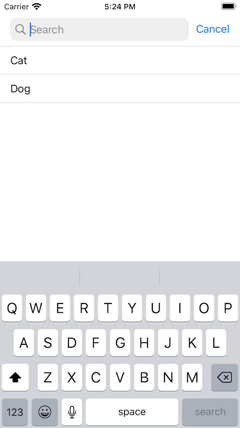
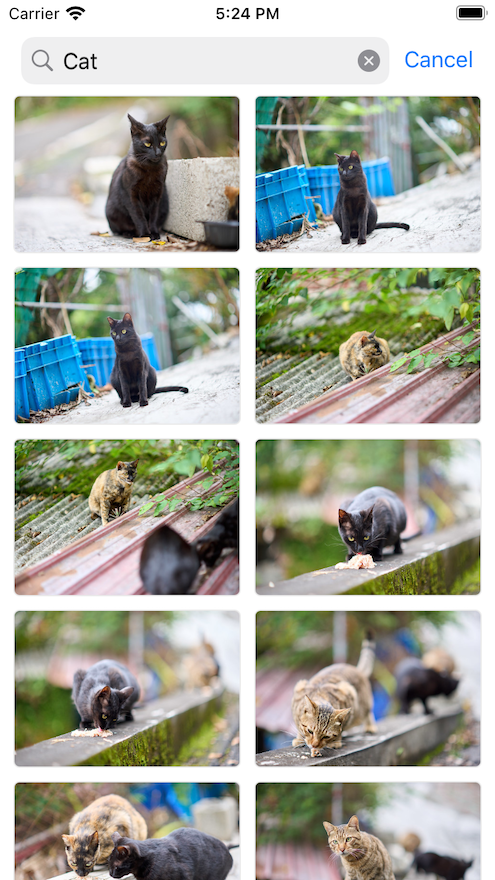

FlickrSearch
-------------------

## Info
* #### API: https://flickr.com
* #### Architecture: VIPER
* #### Programing Languages: Swift
* #### Dependency Management: Swift Package Manager
* #### UI: Storyboards
* #### Models: Support Codable
* #### Testing: both Unit Tests and UI tests

## Libraries/Pods
* #### [Moya](https://github.com/Moya/Moya)
* #### [Kingfisher](https://github.com/onevcat/Kingfisher)

## Building the code
1. Install the latest [Xcode developer tools](https://developer.apple.com/xcode/downloads/) from Apple. (preferably the latest Xcode 13.0 <= ).
1. Open `FlickerSearch.xcodeproj` in Xcode.
1. Build and run the `Debug` scheme in Xcode.

-------------------
## ScreenShots
#### SearchImage

#### SearchImage

#### SearchImageResult

#### SearchImageResult

